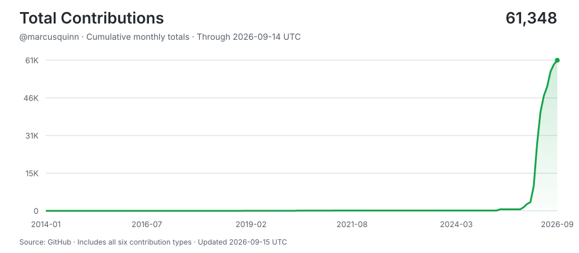

# Marcus Quinn

**Open-Source wins. You can't lose what you give freely. Knowledge shared, multiplies.**

> Shipping with AI agents around the clock -- human hours for thinking, machine hours for doing.
>
> Stats auto-updated by [aidevops](https://aidevops.sh).

<!-- STATS-START -->
## Work with AI

| Metric | Yesterday | Prior 7 Days | Prior 28 Days | Prior 365 Days |
| --- | ---: | ---: | ---: | ---: |
| Screen time (Mac) | 15.1h | 83.9h | 312.8h | ~3530h* |
| Interactive human attention | 9.3h | 28.8h | 85.4h | 965.0h |
| Interactive AI generation | 45.0h | 166.6h | 620.4h | 3969.8h |
| Worker-classified human attention | 0.8h | 2.2h | 23.8h | 220.8h |
| Worker/headless AI generation | 7.5h | 31.8h | 169.7h | 4885.9h |
| Additive observed work | 62.5h | 228.2h | 896.5h | 9,992.5h |
| Interactive sessions | 50 | 476 | 728 | 8,110 |
| Worker sessions | 164 | 705 | 3,214 | 32,928 |

_Screen time from screen-time-history:daily-observations; collection status: ok. *365-day estimate uses observed calendar coverage._

_Periods are completed local calendar days ending at midnight; today is excluded._

_Human attention is unioned wall-clock time, so overlapping sessions are not double-counted. AI generation is additive machine work across sessions; it is not wall-clock concurrency._

_AI session 365-day totals cover 300 days of local assistant session history (not extrapolated)._

## AI Model Usage (last 30 days)

| Model | Requests | Input | Output | Cache read | Cache Hit-Rate % | Session Count | Session Hours |
| --- | ---: | ---: | ---: | ---: | ---: | ---: | ---: |
| gpt-5.6-sol | 53,983 | 196.7M | 11.2M | 6,756.5M | 97.2% | 482 | 425.2h |
| gpt-6-astra | 19,670 | 85.3M | 5.8M | 3,962.0M | 97.9% | 156 | 235.5h |
| gpt-5.6-terra | 13,887 | 85.9M | 2.8M | 763.6M | 89.9% | 1,113 | 81.4h |
| gpt-6-sol | 9,534 | 42.7M | 1.7M | 2,515.1M | 98.3% | 47 | 76.9h |
| gpt-5.6-luna | 3,564 | 44.8M | 659K | 231.7M | 83.8% | 1,525 | 15.9h |
| gpt-6-luna | 62 | 960K | 4K | 819K | 46.0% | 40 | 0.1h |
| **Total** | **100,700** | **456.6M** | **22.3M** | **14,229.8M** | **96.9%** | **3,339** | **835.1h** |

_14,708.8M total tokens processed. 96.9% cache hit rate._

## AI Model Usage (all time)

| Model | Requests | Input | Output | Cache read | Cache Hit-Rate % | Session Count | Session Hours |
| --- | ---: | ---: | ---: | ---: | ---: | ---: | ---: |
| claude-sonnet-4-6 | 317,151 | 249.2M | 99.5M | 23,951.5M | 99.0% | 9,476 | 1,398.1h |
| gpt-5.6-sol | 291,159 | 1,526.9M | 73.1M | 35,040.8M | 95.8% | 4,143 | 2,716.9h |
| gpt-5.5 | 256,472 | 1,244.0M | 48.4M | 22,335.9M | 94.7% | 6,487 | 2,209.6h |
| claude-opus-4-6 | 165,978 | 112.2M | 60.1M | 16,297.3M | 99.3% | 4,501 | 816.2h |
| claude-opus-4-7 | 39,573 | 52K | 38.3M | 5,405.7M | 100.0% | 420 | 320.7h |
| gpt-5.3-codex | 35,951 | 209.0M | 9.6M | 2,401.7M | 92.0% | 1,570 | 178.2h |
| gpt-5.6-terra | 26,138 | 153.3M | 5.4M | 1,504.1M | 90.7% | 2,917 | 164.6h |
| gpt-6-astra | 19,670 | 85.3M | 5.8M | 3,962.0M | 97.9% | 156 | 235.5h |
| gpt-5.4 | 17,035 | 107.3M | 4.7M | 1,150.8M | 91.5% | 739 | 89.8h |
| gpt-5.6-luna | 12,055 | 144.0M | 2.6M | 1,057.9M | 88.0% | 3,249 | 84.8h |
| gpt-6-sol | 9,534 | 42.7M | 1.7M | 2,515.1M | 98.3% | 47 | 76.9h |
| claude-haiku-4-5 | 2,987 | 4K | 751K | 201.2M | 100.0% | 234 | 8.1h |
| gemini-3-flash | 2,339 | 34.0M | 624K | 88.4M | 72.2% | 166 | 9.8h |
| gpt-5.4-mini | 2,000 | 9.9M | 316K | 113.4M | 92.0% | 294 | 12.3h |
| gpt-5.2 | 579 | 1.8M | 353K | 20.3M | 91.6% | 91 | 3.1h |
| kimi-k2.6 | 81 | 2.2M | 25K | 2.8M | 56.2% | 3 | 0.4h |
| gpt-5.3-codex-spark | 78 | 492K | 71K | 3.6M | 88.0% | 7 | 0.1h |
| big-pickle | 76 | 84K | 17K | 3.1M | 97.4% | 5 | 0.2h |
| gpt-6-luna | 62 | 960K | 4K | 819K | 46.0% | 40 | 0.1h |
| claude-opus-4-5 | 51 | 10 | 23K | 3.5M | 100.0% | 5 | 0.2h |
| mimo-v2-omni-free | 48 | 160K | 11K | 3.4M | 95.5% | 2 | 0.1h |
| gemini-3.1-pro | 47 | 0 | 0 | 0 | 0.0% | 47 | 0.0h |
| composer-2 | 21 | 0 | 0 | 0 | 0.0% | 13 | 0.2h |
| mimo-v2-pro-free | 17 | 77K | 3K | 1.1M | 93.9% | 1 | 0.0h |
| minimax-m2.5-free | 12 | 10K | 1K | 211K | 95.3% | 2 | 0.0h |
| gpt-5.5-pro | 8 | 0 | 0 | 0 | 0.0% | 5 | 0.0h |
| claude-opus-4-6 | 5 | 0 | 0 | 0 | 0.0% | 4 | 0.0h |
| claude-sonnet-4 | 4 | 17 | 231 | 76K | 100.0% | 1 | 0.0h |
| qwen3.6-plus-free | 4 | 202K | 2K | 0 | 0.0% | 1 | 0.0h |
| anthropic/claude-opus-4.1 | 2 | 28K | 234 | 27K | 49.7% | 1 | 0.0h |
| claude-3-7-sonnet-latest | 1 | 0 | 0 | 0 | 0.0% | 1 | 0.0h |
| claude-opus-4-6-fast | 1 | 0 | 0 | 0 | 0.0% | 1 | 0.0h |
| gemini-3-pro-preview | 1 | 0 | 0 | 0 | 0.0% | 1 | 0.0h |
| gpt-5.6 | 1 | 0 | 0 | 0 | 0.0% | 1 | 0.0h |
| gpt-5.6-sol-pro | 1 | 13K | 40 | 0 | 0.0% | 1 | 0.0h |
| nemotron-3-super-free | 1 | 83K | 129 | 0 | 0.0% | 1 | 0.0h |
| **Total** | **1,199,143** | **3,924.6M** | **351.8M** | **116,065.7M** | **96.7%** | **34,478** | **8,326.1h** |

_122,350.9M total tokens processed. 96.7% cache hit rate._
<!-- STATS-END -->

## Projects

- **[cloudron-buzz-app](https://github.com/marcusquinn/cloudron-buzz-app)** -- Cloudron.io app package for self-hosting Buzz.xyz Nostr relay, with storage management, backups, and auto-updates.
- **[homebrew-tap](https://github.com/marcusquinn/homebrew-tap)** -- Homebrew tap for aidevops and other tools
- **[aidevops](https://github.com/marcusquinn/aidevops)** -- Vibe-Coding is easy. DevOps is hard. AI DevOps automates your software, business, and personal development with managed infrastructure through AI chat in OpenCode. Opinionated tools, services, CLI & API tech-stack — for speed, security, and 24/7 results. Open-source-preferred, and SOTA everything.
- **[aidevops.sh](https://github.com/marcusquinn/aidevops.sh)** -- The AI Devops website source code for https://aidevops.sh
- **[quickfile-mcp](https://github.com/marcusquinn/quickfile-mcp)** -- MCP server for QuickFile UK accounting software - invoices, clients, purchases, banking, and reports
- **[cloudron-netbird-app](https://github.com/marcusquinn/cloudron-netbird-app)** -- NetBird WireGuard mesh VPN - Cloudron app package
- **[aidevops-cloudron-app](https://github.com/marcusquinn/aidevops-cloudron-app)** -- Cloudron app: always-on remote worker node for AI DevOps — headless Claude Code dispatch, multi-node orchestration
- **[amazon-order-history-csv-download-mcp](https://github.com/marcusquinn/amazon-order-history-csv-download-mcp)** -- Download Amazon Order History As Orders & Items CSV files, plus simplified CSV file versions for importing to your accounting software. Supports Amazon United States US, United Kingdom, Canada, Germany, France, Spain, Italy, Netherlands, Japan, Australia, Mexico, India, UAE, Saudi Arabia, Ireland, Belgium
- **[marcusquinn.github.io](https://github.com/marcusquinn/marcusquinn.github.io)** -- Personal Website, Work, Ecommerce, Social Links, Software, Hosting, Services, Preferences, Audio, Music, Video, Markdown, Plain Text, Links
<!-- CONTRIBUTIONS-START -->
## Contributions

- **[awesome-opencode](https://github.com/awesome-opencode/awesome-opencode)** -- A curated list of awesome plugins, themes, agents, projects, and resources for https://opencode.ai
- **[awesome-selfhosted](https://github.com/awesome-selfhosted/awesome-selfhosted)** -- A list of Free Software network services and web applications which can be hosted locally. Selfhosting is the process of hosting and managing applications instead of renting from Software-as-a-Service providers
- **[bash-language-server](https://github.com/bash-lsp/bash-language-server)** -- A language server for Bash
- **[buzz](https://github.com/block/buzz)** -- A hive mind communication platform
- **[claude-code-mcp](https://github.com/steipete/claude-code-mcp)** -- Claude Code as one-shot MCP server to have an agent in your agent.
- **[ClaudeBar](https://github.com/tddworks/ClaudeBar)** -- A macOS menu bar application that monitors AI coding assistant usage quotas. Keep track of your Claude, Codex, Antigravity ,and Gemini usage at a glance.
- **[extro](https://github.com/turbostarter/extro)** -- Open source browser extension starter kit 🧩
- **[git-updater](https://github.com/afragen/git-updater)** -- This WP plugin will update GitHub, Bitbucket, GitLab, and Gitea hosted plugins and themes
- **[loading-ui](https://github.com/turbostarter/loading-ui)** -- Spinners, loaders and loading animations for modern web apps ⏳
- **[mainwp-child](https://github.com/wpallstars/mainwp-child)** -- The MainWP Child plugin is installed on the WordPress sites that you want to control from the MainWP Dashboard.
- **[mcp-adapter](https://github.com/WordPress/mcp-adapter)** -- An MCP adapter that bridges the Abilities API to the Model Context Protocol, enabling MCP clients to discover and invoke WordPress plugin, theme, and core abilities programmatically.
- **[opencode-cursor](https://github.com/ephraimduncan/opencode-cursor)** -- Use your cursor subscription in opencode
- **[opencode](https://github.com/anomalyco/opencode)** -- The open source coding agent.
- **[tabby](https://github.com/Eugeny/tabby)** -- A terminal for a more modern age
- **[Turing-CSS](https://github.com/wangjs-jacky/Turing-CSS)** -- Typora theme inspired by the style of typewritten articles
- **[ultimate-multisite](https://github.com/Ultimate-Multisite/ultimate-multisite)** -- Website as a service plugin for WordPress Multisite
- **[wp-performance-action](https://github.com/swissspidy/wp-performance-action)** -- Reusable GitHub action to measure performance metrics of WordPress sites
<!-- CONTRIBUTIONS-END -->

## Connect

---

<!-- UPDATED-START -->
_Stats auto-updated 2026-09-24 17:24 UTC by [aidevops](https://aidevops.sh) pulse._
<!-- UPDATED-END -->

<!-- TOTAL-CONTRIBUTIONS-START -->

  <a href="https://commit-history.com/marcusquinn?metric=total" target="_blank" rel="noopener noreferrer">
    <picture>
      <source media="(prefers-color-scheme: dark)" srcset="assets/contributions/total-dark.svg" />
      
    </picture>
  </a>

[Verify on commit-history.com](https://commit-history.com/marcusquinn?metric=total) · [Chart data](assets/contributions/total.json)

Includes commits, issues, pull requests, reviews, repositories, and restricted contributions. Refreshed daily through the prior UTC day; commit-history.com may use a different refresh cutoff. GitHub controls link navigation—Ctrl/Cmd-click opens verification in a new tab.
<!-- TOTAL-CONTRIBUTIONS-END -->
