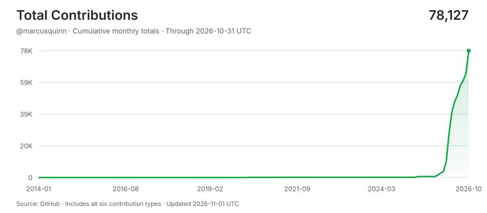

# Marcus Quinn

**Open-Source wins. You can't lose what you give freely. Knowledge shared, multiplies.**

> Shipping with AI agents around the clock -- human hours for thinking, machine hours for doing.
>
> Stats auto-updated by [aidevops](https://aidevops.sh).

<!-- STATS-START -->
## Work with AI

| Metric | Yesterday | Prior 7 Days | Prior 28 Days | Prior 365 Days |
| --- | ---: | ---: | ---: | ---: |
| Screen time (Mac) | 12.8h | 92.5h | 338.5h | ~3843h* |
| Input activity (Mac) | 10.6h | 83h | 199.2h | ~4433h* |
| Interactive human attention | 4.2h | 31.6h | 161.2h | 1374.6h |
| Interactive AI generation | 45.7h | 514.5h | 2455.5h | 8349.8h |
| Worker-classified human attention | 5.9h | 52.2h | 119.3h | 373.0h |
| Worker/headless AI generation | 148.3h | 1229.2h | 2135.9h | 7892.4h |
| Additive observed work | 203.1h | 1819.1h | 4,846.0h | 17,904.3h |
| Interactive sessions | 26 | 157 | 517 | 9,650 |
| Worker sessions | 739 | 4,165 | 8,099 | 47,403 |

_Screen time from screen-time-history:daily-observations; collection status: ok, stale. *365-day estimate uses observed calendar coverage._

_Input activity from macos-input-activity:idle-cutoff-300s (time from each keyboard, mouse or trackpad input until 5 idle minutes); collection status: ok. Input sampling began 2026-11-10 (16.4 of 28 days sampled); earlier days are not counted. *365-day estimate uses sampled calendar coverage._

_Periods are completed local calendar days ending at midnight; today is excluded._

_Human attention is unioned wall-clock time, so overlapping sessions are not double-counted. AI generation is additive machine work across sessions; it is not wall-clock concurrency._

## AI Model Usage (last 30 days)

| Model | Requests | Input | Output | Cache read | Cache write | Cache Hit-Rate % | Session Count | Session Hours |
| --- | ---: | ---: | ---: | ---: | ---: | ---: | ---: | ---: |
| claude-haiku-5-5 | 12 | 0 | 0 | 0 | 0 | 0.0% | 2 | — |
| **Total** | **12** | **0** | **0** | **0** | **0** | **0%** | **2** | **—** |

_0 total tokens processed. 0% cache hit rate._

## AI Model Usage (all time)

| Model | Requests | Input | Output | Cache read | Cache write | Cache Hit-Rate % | Session Count | Session Hours |
| --- | ---: | ---: | ---: | ---: | ---: | ---: | ---: | ---: |
| claude-haiku-4-5 | 1,402 | 119K | 2K | 40.7M | 10.1M | 79.8% | 49 | — |
| claude-opus-4-6 | 1,227 | 39K | 10K | 70.8M | 7.5M | 90.3% | 39 | — |
| claude-opus-4-5 | 615 | 74K | 17K | 44.7M | 3.6M | 92.4% | 18 | — |
| claude-sonnet-4-6 | 401 | 4K | 5K | 33.2M | 1.3M | 96.0% | 30 | — |
| claude-sonnet-4-5 | 395 | 2K | 3K | 11.3M | 3.3M | 77.0% | 9 | — |
| claude-haiku-5-5 | 14 | 0 | 0 | 0 | 0 | 0.0% | 2 | — |
| claude-sonnet-4 | 1 | 1K | 500 | 0 | 0 | 0.0% | 0 | — |
| **Total** | **4,055** | **240K** | **40K** | **201.0M** | **26.1M** | **88.4%** | **125** | **—** |

_227.4M total tokens processed. 88.4% cache hit rate._
<!-- STATS-END -->

<!-- PROJECTS-START -->
## Projects

- **[aidevops](https://github.com/marcusquinn/aidevops)** -- Vibe-Coding is easy. DevOps is hard. OpenCode & Git token-efficient AI agent automation for your app, business, and personal development. Opinionated tools, services, CLI & API stack for speed, security, and 24/7 results. Open-source first. SOTA everything. The best AI harness for GitHub & teamwork.
- **[aidevops-cloudron-app](https://github.com/marcusquinn/aidevops-cloudron-app)** -- Cloudron app: always-on remote worker node for AI DevOps — headless Claude Code dispatch, multi-node orchestration
- **[aidevops.sh](https://github.com/marcusquinn/aidevops.sh)** -- The AI Devops website source code for https://aidevops.sh
- **[amazon-order-history-csv-download-mcp](https://github.com/marcusquinn/amazon-order-history-csv-download-mcp)** -- Download Amazon Order History As Orders & Items CSV files, plus simplified CSV file versions for importing to your accounting software. Supports Amazon United States US, United Kingdom, Canada, Germany, France, Spain, Italy, Netherlands, Japan, Australia, Mexico, India, UAE, Saudi Arabia, Ireland, Belgium
- **[cloudron-buzz-app](https://github.com/marcusquinn/cloudron-buzz-app)** -- Cloudron.io app package for self-hosting Buzz.xyz Nostr relay, with storage management, backups, and auto-updates.
- **[cloudron-headscale-app](https://github.com/marcusquinn/cloudron-headscale-app)** -- Headscale self-hosted Tailscale-compatible control server - Cloudron app package
- **[cloudron-librecrawl-app](https://github.com/marcusquinn/cloudron-librecrawl-app)** -- LibreCrawl self-hosted SEO crawler - Cloudron app package
- **[cloudron-netbird-app](https://github.com/marcusquinn/cloudron-netbird-app)** -- NetBird WireGuard mesh VPN - Cloudron app package
- **[cloudron-netbird-router-app](https://github.com/marcusquinn/cloudron-netbird-router-app)** -- NetBird routing peer for Cloudron VPN-protected apps - Cloudron app package
- **[cloudron-nostr-relay-app](https://github.com/marcusquinn/cloudron-nostr-relay-app)** -- Private allowlisted Nostr relay strfry - Cloudron app package
- **[cloudron-nostr-vpn-app](https://github.com/marcusquinn/cloudron-nostr-vpn-app)** -- Nostr VPN FIPS transit and bootstrap node - Cloudron app package
- **[cloudron-opendesk-app](https://github.com/marcusquinn/cloudron-opendesk-app)** -- Cloudron app package for opendesk, the open-source support inbox and live chat
- **[cloudron-orbit-app](https://github.com/marcusquinn/cloudron-orbit-app)** -- Orbit open-source tasks, docs and chat for teams - Cloudron app package
- **[cloudron-warmbly-app](https://github.com/marcusquinn/cloudron-warmbly-app)** -- Cloudron app package for Warmbly, the open-source cold email and deliverability platform
- **[essentials.com](https://github.com/essentials-com/essentials.com)** (essentials-com) -- ESSENTIALS.COM website
- **[homebrew-tap](https://github.com/marcusquinn/homebrew-tap)** -- Homebrew tap for aidevops and other tools
- **[marcusquinn.github.io](https://github.com/marcusquinn/marcusquinn.github.io)** -- Personal Website, Work, Ecommerce, Social Links, Software, Hosting, Services, Preferences, Audio, Music, Video, Markdown, Plain Text, Links
- **[quickfile-mcp](https://github.com/marcusquinn/quickfile-mcp)** -- MCP server for QuickFile UK accounting software - invoices, clients, purchases, banking, and reports
- **[quimbleshaw](https://github.com/marcusquinn/quimbleshaw)** -- Quimbleshaw: a free pixel-art hat-stacking browser game. Catch falling hats, balance a wobbling tower and knock the hats off your rivals. Play at quimbleshaw.meme
- **[seoproanalytics](https://github.com/wpallstars/seoproanalytics)** (wpallstars) -- Actionable analytics: connect your content to the data that shows you how to grow. Private stats, search rankings and sales, no cookies.
- **[seoprocookieconsent](https://github.com/wpallstars/seoprocookieconsent)** (wpallstars) -- SEO Pro Cookie Consent: the simplest, lightest cookie consent for WordPress. Blocks scripts until consent, geo-aware rules, themed embeds, editable policies. Free.
- **[seoprocustom](https://github.com/wpallstars/seoprocustom)** (wpallstars) -- Change how your theme and plugins behave when their settings can't, without waiting on their makers: one small file per change, in your own copy.
- **[seoprostack](https://github.com/wpallstars/seoprostack)** (wpallstars) -- SEO Pro Stack: opt-in WordPress admin and workflow features plus curated plugin, theme, hosting and tool recommendations.
- **[wp-fix-plugin-does-not-exist-notices](https://github.com/wpallstars/wp-fix-plugin-does-not-exist-notices)** (wpallstars) -- Fix the WordPress "Plugin file does not exist" / "has been deactivated due to an error" message. A small plugin that explains it on the Plugins screen and cleans up what deleted plugins leave behind.
- **[wp-plugin-starter-template-for-ai-coding](https://github.com/wpallstars/wp-plugin-starter-template-for-ai-coding)** (wpallstars) -- A WordPress plugin starter template for coding with AI IDEs, like; Claude Code, Codex, Cursor, etc. aidevops.sh recommended
<!-- PROJECTS-END -->

<!-- CONTRIBUTIONS-START -->
## Contributions

- **[awesome-opencode](https://github.com/awesome-opencode/awesome-opencode)** -- A curated list of awesome plugins, themes, agents, projects, and resources for https://opencode.ai
- **[awesome-selfhosted](https://github.com/awesome-selfhosted/awesome-selfhosted)** -- A list of Free Software network services and web applications which can be hosted locally. Selfhosting is the process of hosting and managing applications instead of renting from Software-as-a-Service providers
- **[bash-language-server](https://github.com/bash-lsp/bash-language-server)** -- A language server for Bash
- **[buzz-app](https://github.com/block/buzz-app)** -- A new desktop/web app experience for buzz
- **[buzz](https://github.com/block/buzz)** -- A hive mind communication platform
- **[claude-code-mcp](https://github.com/steipete/claude-code-mcp)** -- Claude Code as one-shot MCP server to have an agent in your agent.
- **[ClaudeBar](https://github.com/tddworks/ClaudeBar)** -- A macOS menu bar application that monitors AI coding assistant usage quotas. Keep track of your Claude, Codex, Antigravity ,and Gemini usage at a glance.
- **[crosspoint-reader](https://github.com/crosspoint-reader/crosspoint-reader)** -- Open-source e-reader firmware
- **[extro](https://github.com/turbostarter/extro)** -- Open source browser extension starter kit 🧩
- **[git-updater](https://github.com/afragen/git-updater)** -- This WP plugin will update GitHub, Bitbucket, GitLab, and Gitea hosted plugins and themes
- **[loading-ui](https://github.com/turbostarter/loading-ui)** -- Spinners, loaders and loading animations for modern web apps ⏳
- **[mainwp-child](https://github.com/wpallstars/mainwp-child)** -- The MainWP Child plugin is installed on the WordPress sites that you want to control from the MainWP Dashboard.
- **[mcp-adapter](https://github.com/WordPress/mcp-adapter)** -- An MCP adapter that bridges the Abilities API to the Model Context Protocol, enabling MCP clients to discover and invoke WordPress plugin, theme, and core abilities programmatically.
- **[opencode-cursor](https://github.com/ephraimduncan/opencode-cursor)** -- Use your cursor subscription in opencode
- **[opencode](https://github.com/anomalyco/opencode)** -- The open source coding agent.
- **[tabby](https://github.com/Eugeny/tabby)** -- A terminal for a more modern age
- **[Turing-CSS](https://github.com/wangjs-jacky/Turing-CSS)** -- Typora theme inspired by the style of typewritten articles
- **[ultimate-multisite](https://github.com/Ultimate-Multisite/ultimate-multisite)** -- Website as a service plugin for WordPress Multisite
- **[wp-performance-action](https://github.com/swissspidy/wp-performance-action)** -- Reusable GitHub action to measure performance metrics of WordPress sites
<!-- CONTRIBUTIONS-END -->

## Connect

---

<!-- UPDATED-START -->
_Stats auto-updated 2026-11-27 11:20 UTC by [aidevops](https://aidevops.sh) pulse._
<!-- UPDATED-END -->

<!-- TOTAL-CONTRIBUTIONS-START -->

  <a href="https://commit-history.com/marcusquinn?metric=total" target="_blank" rel="noopener noreferrer">
    <picture>
      <source media="(prefers-color-scheme: dark)" srcset="assets/contributions/total-dark.svg" />
      
    </picture>
  </a>

[Verify on commit-history.com](https://commit-history.com/marcusquinn?metric=total) · [Chart data](assets/contributions/total.json)

Includes commits, issues, pull requests, reviews, repositories, and restricted contributions. Refreshed daily through the prior UTC day; commit-history.com may use a different refresh cutoff. GitHub controls link navigation—Ctrl/Cmd-click opens verification in a new tab.
<!-- TOTAL-CONTRIBUTIONS-END -->
